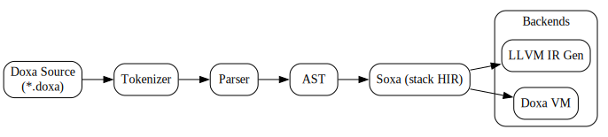

# Doxa Programming Language [[Docs]](https://mirror-shades.github.io/doxa/)[](https://deepwiki.com/mirror-shades/doxa)

Doxa is inspired by Nagarjuna's four cornered logic, known as Catuṣkoṭi. Doxa does not use bools but instead tetras. A tetra (short for tetralemma) is a logical value with four possible states or corners:

```
P (true)
¬ P (false)
P ∧ ¬ P (both)
¬ ( P ∨ ¬ P ) (neither)
```

See documentation for a more detailed explaination of how this works.

## Components



- **Lexer**: Tokenizes source code
- **Parser**: Builds an AST from tokens
- **Soxa** A stack based HIR for high level optimization
- **VM**: Stack based, operates from Soxa IR
- **LLVM IR** Code generator to turn Soxa into LLVM IR for native compilation

## Memory management

Memory is managed but not via garbage collection. Doxa uses an automated refence counter much like Swift but with some unique changes which leverage the power of the Zig language allocation system. Without getting overly technical, each scope is allocated as an arena which is cleaned up when that scope is exited. Combined with traditional refrence counting this provides an extremely robust and _predictable_ form of automatic memory management which avoids many of the pitfalls of garbage collection while remaining totally automatic.

## Usage

```bash
zig build
./zig-out/bin/doxa [--debug] ./path/to/file.doxa
```

## Development Status

- ✅ **AST Interpreter**: Fully functional, supports all language features, will be deprecated for VM
- ✅ **Soxa VM**: currently implementing stack based HIR and VM
- ❌ **LLVM IR**: Minimal prototyping, many features missing, future

## Value Types

### Atomic

- int (32-bit integer)
- float (64-bit float)
- byte (8-bit uint hex literal)
- string
- tetra (four-value logic unit)
- nothing (void/null type)

### Molecular

- array (homogeneous)
- map
- struct
- enum
- union
- function

### Meta

- alias (pass-by-alias for mutation)
- intrinsic (@length, @cast, etc.)

## Example

```solidity
// a brainfuck interpreter implemented in doxa
// mirror-shades

const symbols is [ ">", "<", "+", "-", ".", ",", "[", "]" ];

// input is read as a string and converted to
// an array of u8 using the bytes method
function getInput() returns(u8) {
    var userInput :: string is input;
    var newByte :: u8 is userInput.bytes[0];
    return newByte;
}

function startLoop() {
    if loopSpot.length equals loops
    then {
        loopSpot.push(ip);
    } else {
        loopSpot[loops] is ip;
    }
    loops += 1;
}

function endLoop() {
    if loops >= 0
    then {
        if tape[tp] equals 0
        then {
            loops -= 1;
        } else {
            const loopPointer is loops - 1;
            ip is loopSpot[loopPointer];
            // cancels the ip += 1 from the main loop
            ip -= 1;
        }
    }
}

function checkClosingBracket(scan :: string) returns(tetra) {
    var pointer :: int is 0;
    var openBrackets :: int is 0;
    while(pointer < @length(scan)) {
        if(scan[pointer] equals "[") then openBrackets += 1;
        if(scan[pointer] equals "]") then openBrackets -= 1;
        pointer += 1;
    }
    return(openBrackets equals 0);
}


function interpret(scan :: string) {
    // tape is a list of u8 values to represent bytes on the tape
    // tape is initialized with 30000 cells
    // this can be increased to allow for more memory
    var tape :: u8[30000];
    var tp :: int is 0;
    var ip :: int is 0;
    var loops :: int is 0;
    var loopSpot :: int[];
    const scanLength is scan.length;

    // do a pass to check if the brackets are matched
    var closedBrackets :: tetra is checkClosingBracket(scan);
    assert(closedBrackets, "Unmatched brackets");

    while(ip < scanLength) {
        var currentInstruction is scan[ip];
        if(currentInstruction equals ">") then tp += 1;
        if(currentInstruction equals "<") then tp -= 1;
        if(currentInstruction equals "+") then tape[tp] += 1;
        if(currentInstruction equals "-") then tape[tp] -= 1;
        if(currentInstruction equals ".") then tape[tp]?;
        if(currentInstruction equals ",") then tape[tp] is getInput();
        if(currentInstruction equals "[") then startLoop();
        if(currentInstruction equals "]") then endLoop();

        ip += 1;
    }
}

-> function main() {
    interpret(",+.");
}
```
