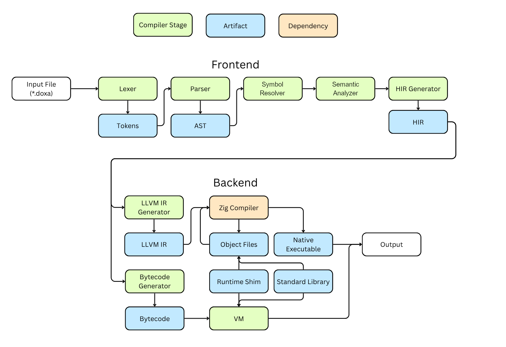

# Doxa Programming Language  
[Documentation](https://mirror-shades.github.io/doxa/)  
[](https://deepwiki.com/mirror-shades/doxa)

Doxa is high level, statically typed, memory managed language. It has a highly readable and consistant syntax aimed at reducing cognative load, and producing code which is simple and aesthetic. It features a novel memory management system based on arena allocation. It eschews privleged error and optional channels in favor of robust type union and narrowing system. It interfaces with Zig, which brings along all of Zig's C interoperability.

Doxa is inspired by Nagarjuna's four cornered logic, known as Catuṣkoṭi. Doxa does not use bools but instead a novel logical type called a tetra. A tetra (short for tetralemma) has four possible states or corners:

```
P (true)
-¬ P (false)
-P ∧ ¬ P (both)
-¬ ( P ∨ ¬ P ) (neither)
```

## Usage

```bash
Usage:
  doxa init [project-name]        # Scaffold a new Doxa project
  doxa run [general options] <file.doxa>
  doxa compile [general options] <file.doxa> -o <output> [compile options]
  doxa --lsp [--lsp-debug-io]     # Start the Language Server Protocol loop
  doxa --lsp-debug <file.doxa>    # Run the in-process LSP debug harness

General options:
  --profile                         # Enable profiling
  --help, -h                        # Show this help message
  --debug-[stage]                   # Enable debug output for [stage]
                                    # lexer, parser, semantic, hir, memory
  --debug-verbose                   # Enable all debug output
  --cache-dir=<dir>                 # Build cache directory (default: .doxa-cache)

Compile options:
  -o, --output <path>               # Output executable path (required)
  --arch=<arch>                     # Target CPU architecture (default: host)
  --os=<os>                         # Target operating system (default: host)
  --abi=<abi>                       # Target ABI (optional)
  --link=<name>                     # Link a native library (-l<name>); repeatable
  --libdir=<dir>                    # Library search path (-L<dir>); repeatable
  --framework=<name>                # Link a macOS framework; repeatable
  --include=<dir>                   # Header search path (-I<dir>); repeatable
  --opt-mode=<debug|safe|fast|small># Zig release mode for the runtime and link step
  -O0..-O3 | --opt=0..3             # clang -O level for the program (-O2 == zig cc -O2)
  --emit-opt-ir                     # Also write optimized LLVM IR (<stem>.opt.ll) to cache
  --emit-asm                        # Also write target assembly (<stem>.s) to cache
  --lsp-debug-io                    # Trace raw LSP I/O when used with --lsp

Examples:
  doxa run file.doxa
  doxa compile file.doxa -o bin/myapp
  doxa compile file.doxa -o bin/myapp --arch=x86_64 --os=linux -O2
```

### Building projects

Builds are ordinary Doxa programs driven by the standard-library build module.
Scaffold a project with `doxa init <name>` (writes a buildable `build.doxa` and
`src/main.doxa`), then build with:

```bash
doxa run build.doxa
```

The script declares artifacts against a `build.Context`, then terminates with
`build.execute(c, false)`, which compiles every artifact and propagates the
result through the process exit code. Artifacts whose output is newer than
their entry source are skipped unless forced (`build.execute(c, true)`).

Cross-compiling names the output for the target OS, not the host: `--os=windows`
appends `.exe`, `--os=linux` does not. A cross target must name both its
architecture and OS (`--arch=`/`--os=`); missing components are a compile error
rather than a silent host default.

### Building from source

Current build uses Zig 0.16.0, there are no other dependencies.

compile from source and run a file

```bash
zig build run -- run ./path/to/file.doxa
```

for consistent results be sure to build before running compiler tests

```bash
zig build
zig build test
```

## Native Types

Doxa is based upon a very small number of types with enums, structs, and type unions providing a huge degree of flexibility to how these core types can be used. Exhaustive match statements and union type narrowing allow for extremly simple yet powerful error handling patterns that takes the idea of errors as values very literally.

### Scalar

- int (64-bit integer)
- float (64-bit float)
- byte (8-bit uint hex literal)
- string
- enum
- tetra (four-value logic unit)
- nothing (void type)

### Composite

- array (homogeneous)
- struct
- group
- union



## TODO:

- flesh out standard lib
- sandbox zig execution
- add better bounding to lsp mode
- break up remaining monolith files
- error recovery for better LSP diagnostics
- expand tests
- improve error logging with better messages
- improve effiency literally everywhere
- improve semantic analysis around negative cases (return statements in void return functions/methods, improper use of symbols (functions used as values), etc.)
- make escape/rehome fully compile-time (decide every .rehome statically (definite region analysis/clone-on-edge))


## Example

```solidity
module std from @std()

# a brainfuck interpreter implemented in doxa
# mirror-shades

function getInput() returns byte {
    const value is std.io.inputByte() as byte else {
        # end of input: report NUL so `,` can terminate a read loop
        return 0x00
    }
    return value
}

# Forward scan from an opening `[` to its matching `]`. Bracket balance is
# validated up front, so a match always exists.
function findClosingBracket(scan :: string, open :: int) returns int {
    var depth :: int
    var cursor :: int is open
    while cursor < @length(scan) do cursor += 1 {
        if scan[cursor] == "[" then depth += 1
        if scan[cursor] == "]" then {
            depth -= 1
            if depth == 0 then return cursor
        }
    }
    return open
}

# `loops` is the current nesting depth and `loopSpot` holds the opening `[`
# position for each depth. A jump-back lands on the `[` again, so a repeat visit
# at the current depth's own slot is a no-op; every other `[` records its slot
# (growing the stack only when a deeper level is opened for the first time).
# A loop whose cell is zero is skipped by jumping straight to its closing `]`.
function startLoop(scan :: string, tape :: byte[], tp :: int, ^loopSpot :: int[], ^loops :: int, ^ip :: int) {
    if tape[tp] == 0 then {
        ip is findClosingBracket(scan, ip)
        return
    }
    if loops > 0 then {
        if loopSpot[loops - 1] == ip then return
    }
    if @length(loopSpot) == loops then {
        @push(loopSpot, ip)
    } else {
        loopSpot[loops] is ip
    }
    loops += 1
}

function endLoop(loopSpot :: int[], ^loops :: int, ^ip :: int, tape :: byte[], tp :: int) {
    if loops >= 0 then {
        if tape[tp] == 0 then {
            loops -= 1
        } else {
            const loopPointer is loops - 1
            ip is loopSpot[loopPointer]
            # cancels the ip += 1 from the main loop
            ip -= 1
        }
    }
}

function checkClosingBracket(scan :: string) returns tetra {
    var pointer :: int
    var openBrackets :: int
    while pointer < @length(scan) do pointer += 1 {
        if scan[pointer] == "[" then openBrackets += 1
        if scan[pointer] == "]" then openBrackets -= 1
        if openBrackets < 0 then return false
    }
    return(openBrackets == 0)
}

function interpret(scan :: string) returns byte[] {
    const tapeSize is 30000
    var tape :: byte[tapeSize]
    var loops :: int
    var loopSpot :: int[]
    var tp :: int
    var ip :: int
    var output :: byte[]

    const scanLength is @length(scan)

    var closedBrackets :: tetra is checkClosingBracket(scan)
    @assert(closedBrackets, "Unmatched brackets")

    while(ip < scanLength) do ip += 1 {
        match scan[ip] {
            ">" then tp += 1,
            "<" then tp -= 1,
            "+" then tape[tp] += 0x01,
            "-" then tape[tp] -= 0x01,
            "." then @push(output, tape[tp]),
            "," then tape[tp] is getInput(),
            "[" then startLoop(scan, tape, tp, ^loopSpot, ^loops, ^ip),
            "]" then endLoop(loopSpot, ^loops, ^ip, tape, tp),
            else @print("Unrecognized Token: {scan[ip]}\n"),
        }
    }

    return output
}

public entry function main() {
    const argc is std.process.argc() as int else 0
    if argc < 2 then @panic("usage: bf <source>")

    const source is std.process.argv(1) as string else {
        @panic("bad argv")
        return
    }

    const output is interpret(source)
    @print(@pack(output))
}
```
